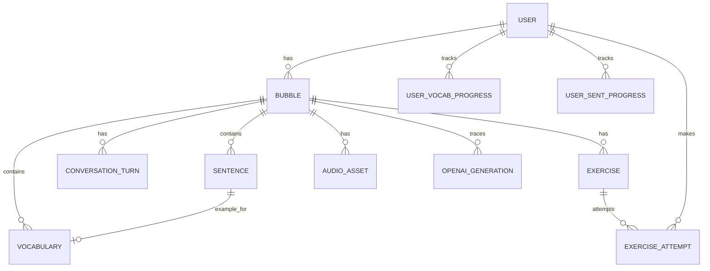

## Data Model

### Entities
- **User**: Account and preferences.
- **Bubble**: Topic bundle for a user.
- **Sentence**: Ordered sentences under a bubble with translations and audio.
- **Vocabulary**: Topic vocabulary with lemma, PoS, translation, example.
- **ConversationTurn**: Two-person dialogue turns.
- **Exercise**: Generated practice items and their metadata.
- **ExerciseAttempt**: User submissions and scoring.
- **UserVocabularyProgress**: Spaced repetition state per vocab.
- **UserSentenceProgress**: Practice state per sentence.
- **AudioAsset**: TTS assets and metadata.
- **OpenAIGeneration**: Traceability for generations.

### ERD

### Tables (proposed)
- **users**: id, email, password_hash, level, native_language, target_language, settings_json, created_at, updated_at
- **bubbles**: id, user_id, topic, target_language, level, status, started_at, completed_at, created_at, updated_at
- **sentences**: id, bubble_id, text, translation, difficulty, order_index, audio_url, created_at
- **vocabulary**: id, bubble_id, lemma, translation, pos, gender, example_sentence_id, frequency, audio_url, created_at
- **conversation_turns**: id, bubble_id, speaker (A|B), text, translation, order_index, audio_url
- **exercises**: id, bubble_id, type, prompt, solution, distractors_json, metadata_json, created_at
- **exercise_attempts**: id, exercise_id, user_id, response_json, is_correct, score, time_spent_ms, created_at
- **user_vocab_progress**: id, user_id, vocab_id, easiness, interval_days, repetitions, last_review_at, next_review_at
- **user_sentence_progress**: id, user_id, sentence_id, easiness, interval_days, repetitions, last_review_at, next_review_at
- **audio_assets**: id, bubble_id, item_type, item_id, provider, voice, url, duration_ms, checksum
- **openai_generations**: id, bubble_id, phase, model, prompt_tokens, completion_tokens, response_id, status, error_message, cost_estimate_cents, created_at

### Indices and constraints
- Unique `(user_id, topic, target_language)` to prevent accidental duplicates.
- Partial indexes for `status IN ('PENDING','RUNNING')` to speed dashboards.
- FKs with `ON DELETE CASCADE` from bubbles to child entities.

