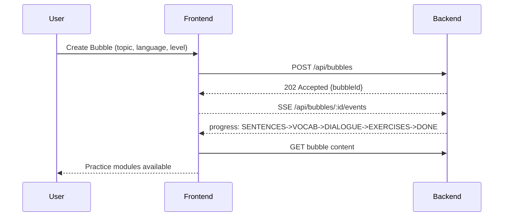

## UX and Flows

### Primary flows

### Screens
- **Home/Create Bubble**: Topic input, language and level selectors.
- **Bubble Overview**: Tabs for Sentences, Vocabulary, Conversation, Practice.
- **Practice**: Flashcards, Dictation, Cloze; due queue and session summary.
- **Conversation**: Stepwise turns with play/next buttons and transcript.
- **Profile**: Level, settings (voice, speed), history of bubbles.

### Accessibility
- Keyboard-first navigation and ARIA roles.
- Adjustable TTS speed, captions, reduced motion.

